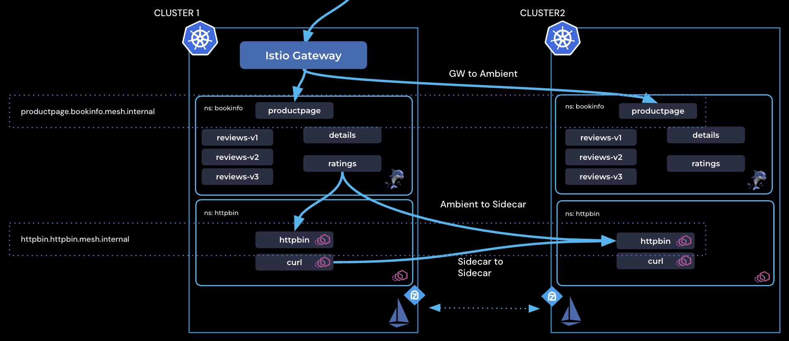
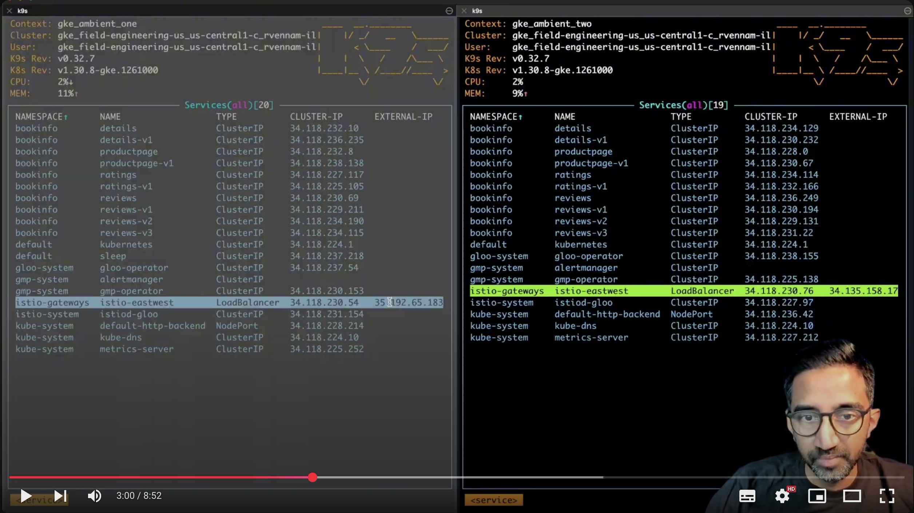
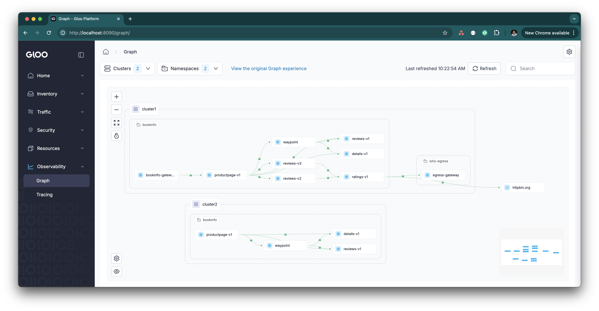

# Solo.io Gloo Mesh Multi-cluster Workshop

In this workshop, you will set up Istio in a multi-cluster environment, deploy a sample Bookinfo app, and explore how Solo.io enables secure service-to-service communication in all directions.



|[](https://youtu.be/18dpBukOYSk) |
|:-----------------------------:|
### Env


**Clean any existing Istio**

```
for context in ${CLUSTER1} ${CLUSTER2}; do
  kubectl get crds --context ${context} | grep istio | awk '{print $1}' | xargs kubectl delete crd --context ${context}
  kubectl get crds --context ${context} | grep tetrate | awk '{print $1}' | xargs kubectl delete crd --context ${context}
done
```

1. Create two clusters and set the env vars below to their context

```bash
export CLUSTER1=gke_ambient_one # UPDATE THIS
export CLUSTER2=gke_ambient_two # UPDATE THIS
export GLOO_MESH_LICENSE_KEY= # UPDATE THIS

export ISTIO_VERSION=1.25.1
export REPO_KEY=e038d180f90a
export ISTIO_IMAGE=${ISTIO_VERSION}-solo
export REPO=us-docker.pkg.dev/gloo-mesh/istio-${REPO_KEY}
export HELM_REPO=us-docker.pkg.dev/gloo-mesh/istio-helm-${REPO_KEY}
```
2. Download Solo's 1.25.1 `istioctl` Binary:
```bash
OS=$(uname | tr '[:upper:]' '[:lower:]' | sed -E 's/darwin/osx/')
ARCH=$(uname -m | sed -E 's/aarch/arm/; s/x86_64/amd64/; s/armv7l/armv7/')

mkdir -p ~/.istioctl/bin
curl -sSL https://storage.googleapis.com/istio-binaries-e038d180f90a/${ISTIO_VERSION}-solo/istioctl-${ISTIO_VERSION}-solo-${OS}-${ARCH}.tar.gz | tar xzf - -C ~/.istioctl/bin
chmod +x ~/.istioctl/bin/istioctl

export PATH=${HOME}/.istioctl/bin:${PATH}
```

3. Verify using `istioctl version`


### Deploy Bookinfo & httpbin samples to both clusters
```bash
for context in ${CLUSTER1} ${CLUSTER2}; do
  kubectl --context ${context} apply -n service-mesh -f https://raw.githubusercontent.com/istio/istio/release-1.24/samples/bookinfo/platform/kube/bookinfo.yaml
  kubectl --context ${context} apply -n service-mesh -f https://raw.githubusercontent.com/istio/istio/release-1.24/samples/bookinfo/platform/kube/bookinfo-versions.yaml
done

for context in ${CLUSTER1} ${CLUSTER2}; do
  kubectl --context ${context} apply -n cnp-nginx -f https://raw.githubusercontent.com/istio/istio/refs/heads/master/samples/httpbin/httpbin.yaml
done
```

### Configure Trust - Issue Intermediate Certs

```bash
kubectl get secret cacerts -n istio-system --context $CLUSTER1 -o jsonpath='{.data.root-cert\.pem}' | base64 --decode
kubectl get secret cacerts -n istio-system --context $CLUSTER2 -o jsonpath='{.data.root-cert\.pem}' | base64 --decode
```

```bash
curl -L https://istio.io/downloadIstio | sh -
cd istio-1.25.1
mkdir -p certs
pushd certs
make -f ../tools/certs/Makefile.selfsigned.mk root-ca

function create_cacerts_secret() {
  context=${1:?context}
  cluster=${2:?cluster}
  make -f ../tools/certs/Makefile.selfsigned.mk ${cluster}-cacerts
  kubectl --context=${context} create ns cnp-istio || true
  kubectl --context=${context} create secret generic cacerts -n cnp-istio \
    --from-file=${cluster}/ca-cert.pem \
    --from-file=${cluster}/ca-key.pem \
    --from-file=${cluster}/root-cert.pem \
    --from-file=${cluster}/cert-chain.pem
}

create_cacerts_secret ${CLUSTER1} cluster1
create_cacerts_secret ${CLUSTER2} cluster2
```


Install Istio CRD's on cluster1 and cluster2:

```bash
helm upgrade --install istio-base oci://${HELM_REPO}/base \
--namespace cnp-istio \
--create-namespace \
--kube-context ${CLUSTER1} \
--version ${ISTIO_IMAGE} \
--set global.istioNamespace=cnp-istio \
-f - <<EOF
defaultRevision: ""
profile: ambient
EOF
```

```bash
helm upgrade --install istio-base oci://${HELM_REPO}/base \
--namespace cnp-istio \
--create-namespace \
--kube-context ${CLUSTER2} \
--version ${ISTIO_IMAGE} \
--set global.istioNamespace=cnp-istio \
-f - <<EOF
defaultRevision: ""
profile: ambient
EOF
```

Apply the CRDs for the Kubernetes Gateway API to your cluster, which are required to create components such as waypoint proxies for L7 traffic policies, gateways with the Gateway resource, and more.

```bash
kubectl --context $CLUSTER1 apply -f https://github.com/kubernetes-sigs/gateway-api/releases/download/v1.2.1/standard-install.yaml
kubectl --context $CLUSTER2 apply -f https://github.com/kubernetes-sigs/gateway-api/releases/download/v1.2.1/standard-install.yaml
```

Install istiod on cluster1 and cluster2
```bash
helm upgrade --install istiod oci://${HELM_REPO}/istiod \
--namespace cnp-istio \
--kube-context ${CLUSTER1} \
--version ${ISTIO_IMAGE} \
--set global.istioNamespace=cnp-istio \
-f - <<EOF
env:
  # Assigns IP addresses to multicluster services
  PILOT_ENABLE_IP_AUTOALLOCATE: "true"
  # Disable selecting workload entries for local service routing.
  # Required for Gloo VirtualDestinaton functionality.
  PILOT_ENABLE_K8S_SELECT_WORKLOAD_ENTRIES: "false"
  # Required when meshConfig.trustDomain is set
  PILOT_SKIP_VALIDATE_TRUST_DOMAIN: "true"
  PEERING_DISCOVERY_NAMESPACE: cnp-istio
global:
  hub: ${REPO}
  multiCluster:
    clusterName: cluster1
  network: cluster1
  proxy:
    clusterDomain: cluster.local
  tag: ${ISTIO_IMAGE}
istio_cni:
  namespace: cnp-istio
  enabled: true
meshConfig:
  accessLogFile: /dev/stdout
  defaultConfig:
    proxyMetadata:
      ISTIO_META_DNS_AUTO_ALLOCATE: "true"
      ISTIO_META_DNS_CAPTURE: "true"
resources:
  limits:
    cpu: 2000m
    memory: 2Gi
  requests:
    cpu: 1000m
    memory: 1Gi
# Required to enable multicluster support
platforms:
  peering:
    enabled: true
profile: ambient
license:
    value: ${GLOO_MESH_LICENSE_KEY}
EOF
```

```bash
helm upgrade --install istiod oci://${HELM_REPO}/istiod \
--namespace cnp-istio \
--kube-context ${CLUSTER2} \
--version ${ISTIO_IMAGE} \
--set global.istioNamespace=cnp-istio \
-f - <<EOF
env:
  # Assigns IP addresses to multicluster services
  PILOT_ENABLE_IP_AUTOALLOCATE: "true"
  # Disable selecting workload entries for local service routing.
  # Required for Gloo VirtualDestinaton functionality.
  PILOT_ENABLE_K8S_SELECT_WORKLOAD_ENTRIES: "false"
  # Required when meshConfig.trustDomain is set
  PILOT_SKIP_VALIDATE_TRUST_DOMAIN: "true"
  PEERING_DISCOVERY_NAMESPACE: cnp-istio
global:
  hub: ${REPO}
  multiCluster:
    clusterName: cluster2
  network: cluster2
  proxy:
    clusterDomain: cluster.local
  tag: ${ISTIO_IMAGE}
istio_cni:
  namespace: cnp-istio
  enabled: true
meshConfig:
  accessLogFile: /dev/stdout
  defaultConfig:
    proxyMetadata:
      ISTIO_META_DNS_AUTO_ALLOCATE: "true"
      ISTIO_META_DNS_CAPTURE: "true"
resources:
  limits:
    cpu: 2000m
    memory: 2Gi
  requests:
    cpu: 1000m
    memory: 1Gi
# Required to enable multicluster support
platforms:
  peering:
    enabled: true
profile: ambient
license:
    value: ${GLOO_MESH_LICENSE_KEY}
EOF
```

Install istio-cni on cluster1 and cluster2. **FOR GKE**, uncomment the `platform: gke` line
```bash
helm upgrade --install istio-cni oci://${HELM_REPO}/cni \
--namespace cnp-istio \
--kube-context ${CLUSTER1} \
--version ${ISTIO_IMAGE} \
--set global.istioNamespace=cnp-istio \
-f - <<EOF
# Assigns IP addresses to multicluster services
ambient:
  dnsCapture: true
excludeNamespaces:
  - cnp-istio
  - kube-system
global:
  hub: ${REPO}
  tag: ${ISTIO_IMAGE}
  variant: distroless
  # platform: gke # UNCOMMENT FOR GKE
profile: ambient
resources:
  limits:
    cpu: 200m
    memory: 500Mi
  requests:
    cpu: 100m
    memory: 100Mi
EOF
```

```bash
helm upgrade --install istio-cni oci://${HELM_REPO}/cni \
--namespace cnp-istio \
--kube-context ${CLUSTER2} \
--version ${ISTIO_IMAGE} \
--set global.istioNamespace=cnp-istio \
-f - <<EOF
# Assigns IP addresses to multicluster services
ambient:
  dnsCapture: true
excludeNamespaces:
  - cnp-istio
  - kube-system
global:
  hub: ${REPO}
  tag: ${ISTIO_IMAGE}
  variant: distroless
  # platform: gke # UNCOMMENT FOR GKE
profile: ambient
resources:
  limits:
    cpu: 200m
    memory: 500Mi
  requests:
    cpu: 100m
    memory: 100Mi
EOF
```


Install ztunnel on cluster1 and cluster2
```bash
helm upgrade --install ztunnel oci://${HELM_REPO}/ztunnel \
--namespace cnp-istio \
--kube-context ${CLUSTER1} \
--version ${ISTIO_IMAGE} \
--set global.istioNamespace=cnp-istio \
-f - <<EOF
configValidation: true
enabled: true
env:
  L7_ENABLED: "true"
  # Required when a unique trust domain is set for each cluster
  SKIP_VALIDATE_TRUST_DOMAIN: "true"
hub: ${REPO}
multiCluster:
  clusterName: cluster1
tag: ${ISTIO_IMAGE}
istioNamespace: cnp-istio
namespace: cnp-istio
network: cluster1
profile: ambient
proxy:
  clusterDomain: cluster.local
terminationGracePeriodSeconds: 29
variant: distroless
resources:
  limits:
    cpu: 500m
    memory: 1Gi
  requests:
    cpu: 200m
    memory: 512Mi
EOF
```

```bash
helm upgrade --install ztunnel oci://${HELM_REPO}/ztunnel \
--namespace cnp-istio \
--kube-context ${CLUSTER2} \
--version ${ISTIO_IMAGE} \
--set global.istioNamespace=cnp-istio \
-f - <<EOF
configValidation: true
enabled: true
env:
  L7_ENABLED: "true"
  # Required when a unique trust domain is set for each cluster
  SKIP_VALIDATE_TRUST_DOMAIN: "true"
hub: ${REPO}
multiCluster:
  clusterName: cluster2
tag: ${ISTIO_IMAGE}
istioNamespace: cnp-istio
namespace: cnp-istio
network: cluster2
profile: ambient
proxy:
  clusterDomain: cluster.local
terminationGracePeriodSeconds: 29
variant: distroless
resources:
  limits:
    cpu: 500m
    memory: 1Gi
  requests:
    cpu: 200m
    memory: 512Mi
EOF
```

```bash
kubectl label namespace cnp-istio --context ${CLUSTER1} topology.istio.io/network=cluster1
kubectl label namespace cnp-istio --context ${CLUSTER2} topology.istio.io/network=cluster2
```


### Peer the clusters together

Expose using an east-west gateway:
```bash
istioctl --context=${CLUSTER1} multicluster expose --wait -n cnp-istio
istioctl --context=${CLUSTER2} multicluster expose --wait -n cnp-istio
```

Alternatively, create the east/west gateways manually:
```bash
kubectl apply --context $CLUSTER1 -f- <<EOF
apiVersion: gateway.networking.k8s.io/v1
kind: Gateway
metadata:
  labels:
    istio.io/expose-istiod: "15012"
    topology.istio.io/network: cluster1
  name: istio-eastwest
  namespace: cnp-istio
spec:
  gatewayClassName: istio-eastwest
  listeners:
  - name: cross-network
    port: 15008
    protocol: HBONE
    tls:
      mode: Passthrough
  - name: xds-tls
    port: 15012
    protocol: TLS
    tls:
      mode: Passthrough
EOF

kubectl apply --context $CLUSTER2 -f- <<EOF
apiVersion: gateway.networking.k8s.io/v1
kind: Gateway
metadata:
  labels:
    istio.io/expose-istiod: "15012"
    topology.istio.io/network: cluster2
  name: istio-eastwest
  namespace: cnp-istio
spec:
  gatewayClassName: istio-eastwest
  listeners:
  - name: cross-network
    port: 15008
    protocol: HBONE
    tls:
      mode: Passthrough
  - name: xds-tls
    port: 15012
    protocol: TLS
    tls:
      mode: Passthrough
EOF
```

Link clusters together:
```bash
istioctl multicluster link --contexts=$CLUSTER1,$CLUSTER2 -n cnp-istio
```
Alternatively create the remote peering gateways:

```bash
export CLUSTER1_EW_ADDRESS=$(kubectl get svc -n cnp-istio istio-eastwest --context $CLUSTER1 -o jsonpath="{.status.loadBalancer.ingress[0]['hostname','ip']}")
export CLUSTER2_EW_ADDRESS=$(kubectl get svc -n cnp-istio istio-eastwest --context $CLUSTER2 -o jsonpath="{.status.loadBalancer.ingress[0]['hostname','ip']}")

echo "Cluster 1 east-west gateway: $CLUSTER1_EW_ADDRESS"
echo "Cluster 2 east-west gateway: $CLUSTER2_EW_ADDRESS"

kubectl apply --context $CLUSTER1 -f- <<EOF
apiVersion: gateway.networking.k8s.io/v1
kind: Gateway
metadata:
  annotations:
    gateway.istio.io/service-account: istio-eastwest
    gateway.istio.io/trust-domain: cluster2
  labels:
    topology.istio.io/network: cluster2
  name: istio-remote-peer-cluster2
  namespace: cnp-istio
spec:
  addresses:
  - type: IPAddress
    value: $CLUSTER2_EW_ADDRESS
  gatewayClassName: istio-remote
  listeners:
  - name: cross-network
    port: 15008
    protocol: HBONE
    tls:
      mode: Passthrough
  - name: xds-tls
    port: 15012
    protocol: TLS
    tls:
      mode: Passthrough
EOF

kubectl apply --context $CLUSTER2 -f- <<EOF
apiVersion: gateway.networking.k8s.io/v1
kind: Gateway
metadata:
  annotations:
    gateway.istio.io/service-account: istio-eastwest
    gateway.istio.io/trust-domain: cluster1
  labels:
    topology.istio.io/network: cluster1
  name: istio-remote-peer-cluster1
  namespace: cnp-istio
spec:
  addresses:
  - type: IPAddress
    value: $CLUSTER1_EW_ADDRESS
  gatewayClassName: istio-remote
  listeners:
  - name: cross-network
    port: 15008
    protocol: HBONE
    tls:
      mode: Passthrough
  - name: xds-tls
    port: 15012
    protocol: TLS
    tls:
      mode: Passthrough
EOF
```
Run this please

```bash
kubectl get cm istio-sidecar-injector -n istio-system -ojson | jq .data.values -r|jq .global.hub -r
```
Apply labels to the reviews service for the cluster

```bash
for context in $CLUSTER1 $CLUSTER2; do
  kubectl set env -n service-mesh --context $context deployments/reviews-v1 CLUSTER_NAME=$context
  kubectl set env -n service-mesh --context $context deployments/reviews-v2 CLUSTER_NAME=$context
  kubectl set env -n service-mesh --context $context deployments/reviews-v3 CLUSTER_NAME=$context
done
```

### Enable Istio Ambient for service-mesh Namespace

```bash
for context in ${CLUSTER1} ${CLUSTER2}; do
  kubectl --context ${context} label namespace service-mesh istio.io/dataplane-mode=ambient
done
```

Enable productpage to be multi-cluster on both clusters
```bash
for context in ${CLUSTER1} ${CLUSTER2}; do
  kubectl --context ${context}  -n service-mesh label service productpage solo.io/service-scope=global
  kubectl --context ${context}  -n service-mesh annotate service productpage  networking.istio.io/traffic-distribution=Any
done
```

### Expose Productpage using Istio Gateway

Apply the following Kubernetes Gateway API resources to cluster1 to expose productpage service using an Istio gateway:

```yaml
apiVersion: gateway.networking.k8s.io/v1
kind: Gateway
metadata:
  name: bookinfo-gateway
  namespace: service-mesh
spec:
  gatewayClassName: istio
  listeners:
  - name: http
    port: 80
    protocol: HTTP
    allowedRoutes:
      namespaces:
        from: Same
---
apiVersion: gateway.networking.k8s.io/v1
kind: HTTPRoute
metadata:
  name: bookinfo
  namespace: service-mesh
spec:
  parentRefs:
  - name: bookinfo-gateway
  rules:
  - matches:
    - path:
        type: Exact
        value: /productpage
    - path:
        type: PathPrefix
        value: /static
    - path:
        type: Exact
        value: /login
    - path:
        type: Exact
        value: /logout
    - path:
        type: PathPrefix
        value: /api/v1/products
    # backendRefs:
    # - name: productpage
    #   port: 9080
    backendRefs:
    - kind: Hostname
      group: networking.istio.io
      name: productpage.service-mesh.mesh.internal
      port: 9080

```

Wait until a LB IP gets assigned to bookinfo-gateway-istio svc and then visit the app!

```bash
curl $(kubectl get svc -n service-mesh bookinfo-gateway-istio --context $CLUSTER1 -o jsonpath="{.status.loadBalancer.ingress[0]['hostname','ip']}")/productpage
```
Voila! This should be round robinning between productpage on both clusters.


### Istio Waypoints for L7 Functionality

Istio Waypoints enable Layer 7 traffic management in an Ambient Mesh, providing advanced capabilities like routing, authorization, observability, and security policies. Acting as dedicated traffic proxies, Waypoints handle HTTP, gRPC, and other application-layer protocols, seamlessly integrating with Istio’s security model to enforce fine-grained traffic control.

Let’s apply a Waypoint for the service-mesh namespace and create a header-based routing policy:
	•	Traffic going to reviews Service should route to reviews-v1 by default.
	•	Requests with the header end-user: jason should be directed to reviews-v2 instead.


```bash
for context in ${CLUSTER1} ${CLUSTER2}; do
  istioctl --context=${context} waypoint apply -n service-mesh
  kubectl --context=${context} label ns service-mesh istio.io/use-waypoint=waypoint
  kubectl --context=${context} apply -f ./reviews-v1.yaml 
done
```

### Ambient <-> Sidecar Interop

Enable Istio Sidecars for cnp-nginx namespace and restart pods

```bash
for context in ${CLUSTER1} ${CLUSTER2}; do
  kubectl --context ${context} label namespace cnp-nginx istio-injection=enabled
  kubectl --context ${context} rollout restart deploy -n cnp-nginx 
done
```

**Sidecar to Ambient Multi-Cluster Service**
Next, lets call the global ambient productpage from curl.cnp-nginx in cluster1

```bash
kubectl exec -n cnp-nginx deploy/curl -- curl -s productpage.service-mesh.mesh.internal:9080
```

**Ambient to Sidecar  Multi-Cluster Service**
Now, lets make httpbin sidecar global and call it from ratings ambient pod:

```bash
for context in ${CLUSTER1} ${CLUSTER2}; do
  kubectl --context ${context} -n cnp-nginx label service httpbin solo.io/service-scope=global
done
```

```bash
kubectl --context ${CLUSTER1} exec -n service-mesh deploy/ratings-v1 -c ratings -- curl -v "httpbin.cnp-nginx.mesh.internal:8000"
```

**Sidecar to Sidecar Multi-Cluster Service**

Finally, call global httppbin from ratings ambient pod:
```bash
kubectl exec -n cnp-nginx deploy/curl -- curl -s httpbin.cnp-nginx.mesh.internal:8000
```

### Add headers to the request

You can add arbitrary headers to inbound requests using an HTTPRoute.

First, create a waypoint for httpbin
```bash
kubectl apply --context $CLUSTER1 -f- <<EOF
apiVersion: gateway.networking.k8s.io/v1
kind: Gateway
metadata:
  name: waypoint
  namespace: service-mesh
spec:
  gatewayClassName: istio-waypoint
  listeners:
  - name: proxy
    port: 15008
    protocol: istio.io/PROXY
EOF

kubectl label svc httpbin -n cnp-nginx --context $CLUSTER1 istio.io/use-waypoint=waypoint
```

Then create an HTTP route:

```bash
kubectl apply -f- <<EOF
apiVersion: gateway.networking.k8s.io/v1
kind: HTTPRoute
metadata:
  name: httpbin
  namespace: service-mesh
spec:
  parentRefs:
  - name: httpbin
    kind: Service
    group: ""
  rules:
    - matches:
      - path:
          type: PathPrefix
          value: /
      backendRefs:
       - name: httpbin
         port: 8000
      filters:
        - type: RequestHeaderModifier
          requestHeaderModifier:
            add:
              - name: blackrock
                value: rules
EOF
```

Test by curling the endpoint from busybox:

```bash
curl -ivk http://httpbin.service-mesh:8000/headers
```

## Gloo Management Plane

Optionally, you can deploy the Gloo Management Plane that provides many benefits and features. For this lab, we'll just focus on the UI and the service graph. 

Start by downloading the meshctl cli
```
curl -sL https://run.solo.io/meshctl/install | GLOO_MESH_VERSION=v2.7.2 sh -
export PATH=$HOME/.gloo-mesh/bin:$PATH
```


Cluster1 will act as the management cluster and workload cluster:
```bash
helm repo add gloo-platform https://storage.googleapis.com/gloo-platform/helm-charts
helm repo update

helm upgrade -i gloo-platform-crds gloo-platform/gloo-platform-crds -n gloo-mesh --create-namespace --version=2.7.2
helm upgrade -i gloo-platform gloo-platform/gloo-platform -n gloo-mesh --version 2.7.2 --values mgmt-values.yaml \
  --set licensing.glooMeshLicenseKey=$GLOO_MESH_LICENSE_KEY
```

Then, register cluster2 as a workload cluster to cluster1:
```bash
export TELEMETRY_GATEWAY_ADDRESS=$(kubectl get svc -n gloo-mesh gloo-telemetry-gateway --context $CLUSTER1 -o jsonpath="{.status.loadBalancer.ingress[0]['hostname','ip']}"):4317

meshctl cluster register cluster2  --kubecontext $CLUSTER1 --profiles gloo-core-agent --remote-context $CLUSTER2 --telemetry-server-address $TELEMETRY_GATEWAY_ADDRESS
```

Launch the UI:
```
meshctl dashboard
```


